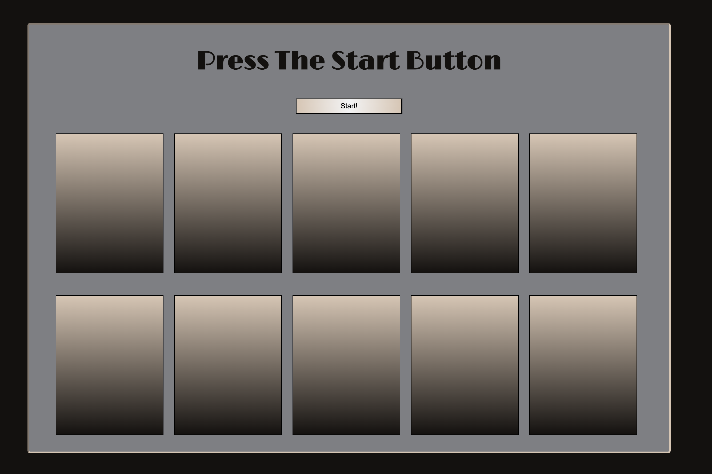

# Matching Card Game
This is an attempt at creating game logic to communicate server-side to client-side to create a good user experience. Also, using some javascript fundamentals to create some fun game logic.

<a href="matching-card.onrender.com">Here is the rendered project</a>

## How It's Made:
_Tech used: HTML, CSS, JavaScript, Node.js_

I used Node to practice building a back-end server and make requests to an API. When the request is made, I simply placed random numbers from 1-10 into an array of 5. When the data came back client-side, I mapped the index of the number to the actual number of the card. This way, each number shows up twice. I also did some client-side scripting to manage the animation and user-interface.

## Lessons Learned:
I learned a lot about setting up both game logic with global scales and creating functions that run on the server. I also learned started scratching the surface of Node and npm by using my first developer package, nodemon, to help streamline the development process.

## More Projects:
<a href="https://github.com/godwinKamau/node-coin-flip-bootcamp">A coin-flip app made with Node</a>
<a href="https://github.com/godwinKamau/complex-api">Using APIs to expand my music tastes</a>